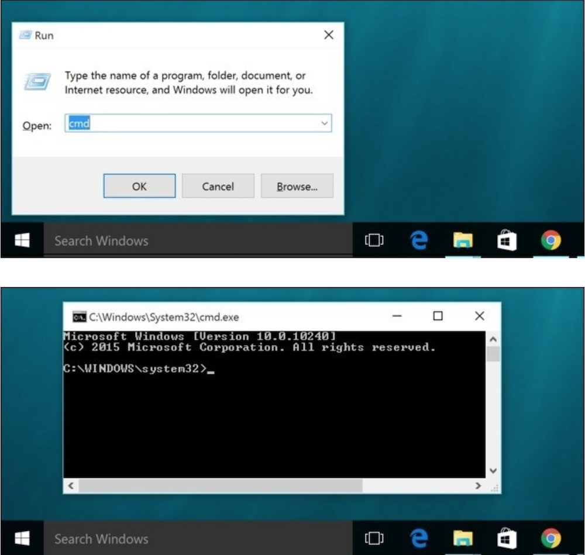

Na początku będziemy korzystać z **konsoli**, **terminala**, **wiersza poleceń** lub **linii poleceń** - wszystkie te wyrażenia oznaczają to samo: okno na komputerze, w którym można wprowadzać polecenia rozumiane przez maszynę - nasz komputer.

Na razie najważniejszą rzeczą jaką musisz wiedzieć to to, jak otworzyć okno konsoli oraz jak ono wygląda w 
zależności od systemu operacyjnego:

## Windows

W zależności od wersji systemu Windows jedna z poniższych instrukcji powinna otworzyć okno poleceń):

- Przejdź do menu Start i wpisz Command Prompt w polu wyszukiwania.
- Start menu → Windows System → Command Prompt.
- Start menu → All Programs → Accessories → Command Prompt.
- Naciśnij specjalny klawisz Windows na klawiaturze i naciśnij klawisz X. Wybierz Command Prompt (wiersz poleceń) z wyskakującego menu.
- Przytrzymaj klawisz Windows i naciśnij klawisz R, aby uzyskać okno "Run" (Uruchom). Wpisz cmd w polu i kliknij przycisk OK.

{:title="Wiersz poleceń Windows 10" class="img-responsive"}

## MacOS
Aby uruchomić terminal na systemach Apple
- Przytrzymaj jednocześnie klawisz cmd ⌘  i klawisz spacja, aby uzyskać okno wyszukiwania. Wpisz **Terminal** w polu i kliknij przycisk enter.
- Applications → Utilities → Terminal

{:title="Terminal MacOs" class="img-responsive"}

Twój terminal po uruchomieniu może być biały. Kolor zmienisz w lewym górnym rogu w sekcji *Preferencje*

## Linux

U użykowników Linuxa **Terminal** prawdopodobnie jest w:
- Applications → Accessories → Terminal
- Applications → System → Terminal

Może to zależeć od systemu. Jeśli nie znajdziesz terminala, możesz spróbować z wyszukiwarką Google. :)

To teraz czas poznać Pythona

