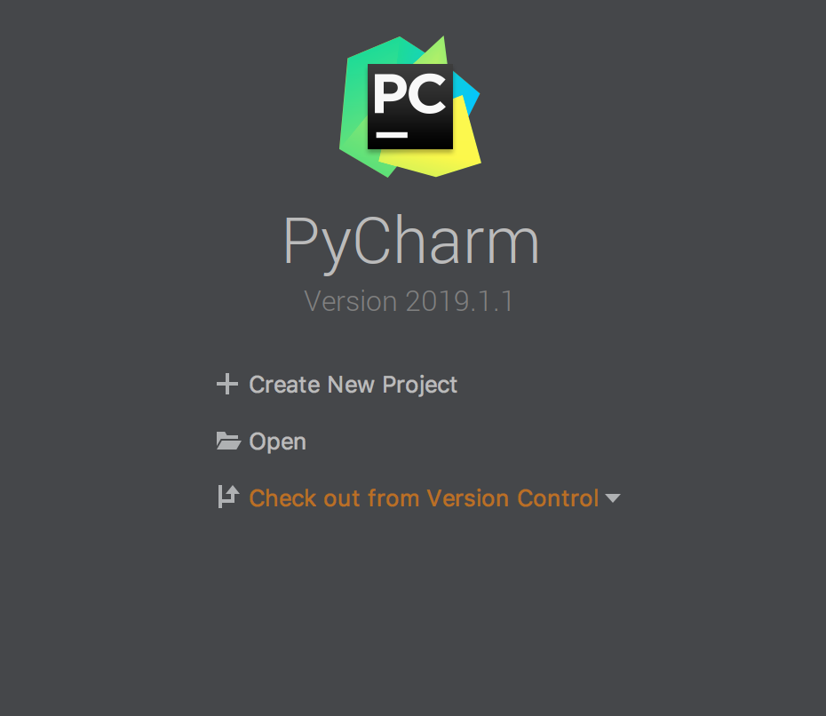
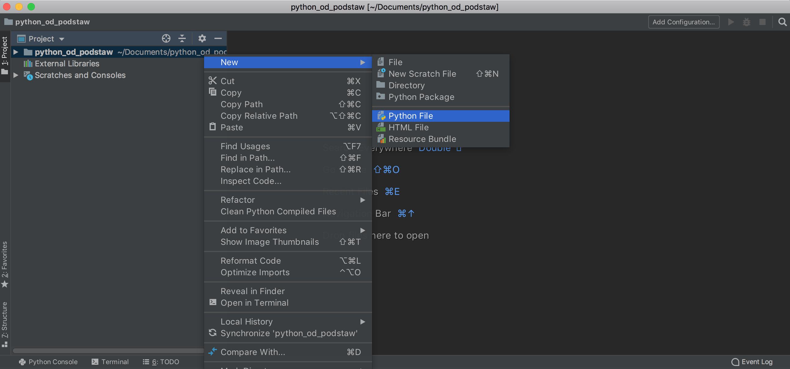

Pisanie kodu w trybie interaktywnym jest dobre na start, jednak nie nadaje się do tworzenia większych programów. Przechodzimy więc do używania edytora.

Niestety, normalne edytory tekstu (właściwie procesory tekstu) jak Microsoft Word, Apple Page czy Google Docs nie nadają się do edycji kodu źródłowego strony web.

Nie używamy programu do edycji dokumentów tekstowych (np. Word), ponieważ tego typu programy zapisują do plików znacznie więcej informacji niż tylko czysty tekst. W formatach dokumentów pojawiają się niewidoczne dla nas informacje o formatowaniu treści (styl tekstu, czcionka, rozkład marginesów itp.) zbędnych dla pliku pisanego w html. Niektóre z edytorów owszem, pozwalają na zapisanie pliku na potrzeby webowe, ale wynik będzie daleki od oczekiwanego.

Program, którego potrzebujesz to edytor tekstu lub edytor kodu. Na start polecamy przyjazny początkującym program PyCharm, albo VSC.


- Na pulpicie (lub w dowolnej innej lokalizacji) utwórz folder dla dzisiejszych zajęć o nazwie `python_od_podstaw`.

- Otwórz edytor. Wybierz `Open` > `twój folder`

{:title="Terminal MacOs" class="img-responsive"} 

- Utwórz nowy plik

{:title="Terminal MacOs" class="img-responsive"} 


Zauważysz, że w twoim folderze pojawił się nowy plik. Pliki Pythona używają rozszerzenia `.py`. 

Dodaj następujące komendy:

```python
print("Hello world")
input("Naciśnij enter, aby zakończyć program: ")
```

Brawo! Oto twój pierwszy skrypt w Pythonie!


### Komentarze 
Komentarze to linie zaczynające się od znaku #. Możesz napisać dowolną informację za znakiem #, a Python ją zignoruje. Komentarze mogą sprawić, że kod będzie łatwiejszy do zrozumienia przez innych programistów, a tekst ten nie będzie widziany przez użytkownika programu.

```python

# to jest komentarz jednolinijkowy

"""
ten komentarz
zajmuje
wiele
linii
"""

print("widać mnie")
# print("a mnie nie widać")

```

#### Zadanie 

Utwórz nowy plik np. `movies.py`. Skopiuj poniższy kod i przeanalizuj. Potraktuj jako bazę do rozwiązania zadania. Dodaj 3 nowe oceny i wylicz srednia z ocen.

```
movie = input("Tytul filmu: ")
grade = int(input("Ocena filmu w skali 1-10: "))

print("Film pt. " + movie)
print("oceniasz na ", grade)

```

Spójrz tutaj jeśli potrzebujesz pomocy:

```python
movie = input("Tytul filmu: ")
grade = int(input("Ocena filmu w skali 1-10: "))
plot = int(input("Ocena scenariusza w skali 1-10: "))
music = int(input("Ocena muzyki w skali 1-10: "))

print("Film pt. " + movie)

avg = (grade + plot + music ) / 3
print("Film pt. ", movie, "oceniasz na", round(avg, 2))

```
{: .solution }
